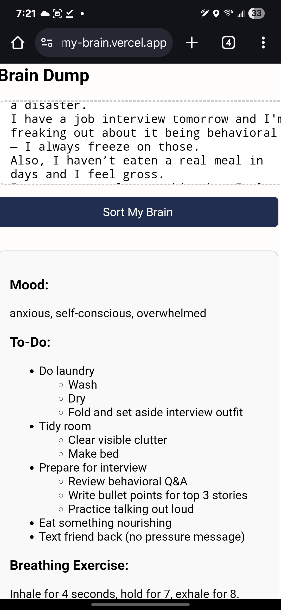

# Sort My Brain

**Sort My Brain** is a web-based journaling tool designed to help people gently organize their overwhelmed thoughts. You start with a freeform brain dump—just typing out whatever is in your head—and the app intelligently extracts your mood, a structured to-do list, and even offers a simple breathing exercise to help you ground yourself.

It’s a soft interface for busy, burnt-out, overstimulated brains. Like a composition notebook with a little bit of magic.

---

## 📸 Preview

---

## Features (Phase 1 – MVP)

### Brain Dump
- Big open textbox for stream-of-consciousness journaling
- Accepts messy, emotional, honest input — no structure required

### Smart Sorting (Local Version)
- Uses JavaScript to detect common patterns in your thoughts
- Parses out your **mood** (e.g. anxious, tired, overwhelmed)
- Extracts a **to-do list** with subtasks from keywords
- Displays a **breathing exercise** prompt (4-7-8 method) for stress relief

### Clean, Cozy UI
- Nostalgic composition book cover intro screen
- Calming visual layout and conversational tone
- Gentle fallback messaging when input is unclear

---

## 🛠️ Tech Stack

- **HTML/CSS** for layout and styling  
- **Vanilla JavaScript** for local logic (parsing, UI control)  
- Built to be easily upgraded with **OpenAI API + Google integrations**

---

## 🔮 Future Roadmap

### ✅ Phase 1 – Local MVP (Complete)
- Brain dump input with keyboard-friendly flow
- Smart parser for moods and tasks
- Clean UI with fallback and breathing support

### 🔄 Phase 2 – Add AI
- Use OpenAI GPT-3.5 to process entries
- Return mood, task list, and encouragement
- Toggle between local and AI parsing

### ⏳ Phase 3 – Mood History
- Log moods and tasks by date
- Track emotional trends over time
- Monthly summaries like “9 anxious days in May”

### ⏳ Phase 4 – Entry Storage
- Save sessions to browser `localStorage`
- Taggable, filterable entries
- Export logs as JSON

### ⏳ Phase 5 – Google Calendar & Tasks Integration
- Add items directly to Google Calendar or Tasks
- Set up OAuth2 and sync
- Optional AI suggestion: “Schedule this?”

---

## 🚀 Usage

1. Clone or download this repository  
2. Open `index.html` in your browser  
3. Start typing, then click **Sort My Brain** to see your organized results

---

## ✨ Why This Exists

This was born from the experience of being mentally overloaded, emotionally stuck, and needing **a place to begin**—not a productivity app yelling at you to “get more done.”

It’s for anyone who’s felt like:
- “I’m so behind on life.”
- “Everything feels too loud.”
- “I want to do better but I don’t know where to start.”

Sort My Brain is for you.

---

## Made with Care

**By Anita Hong**  
Built with empathy, imperfection, and quiet courage.  
Deployed on Vercel. Designed to be both practical and emotionally supportive.

[👉 Try the Live App](https://sort-my-brain.vercel.app)  
[🔗 View the GitHub Repo](https://github.com/your-username/sort-my-brain)
